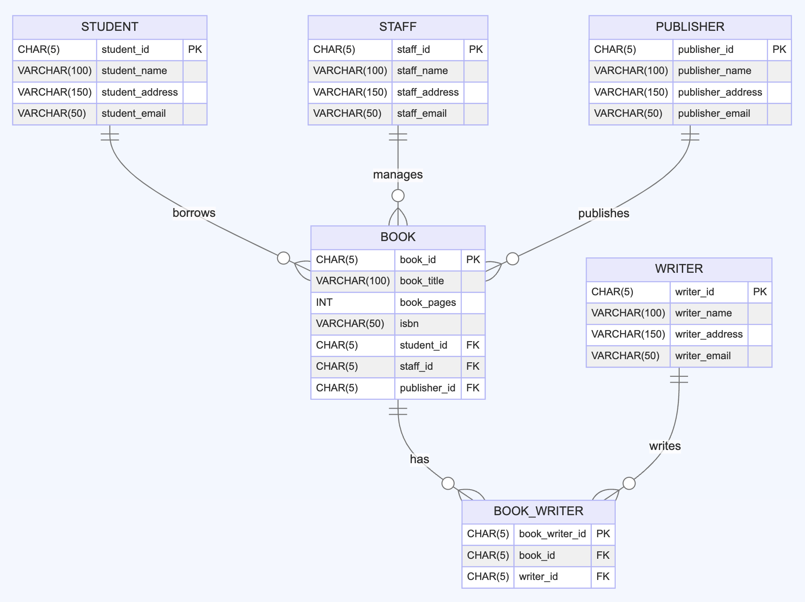

# Hogwarts Library Database

## Project Overview

This project implements a database system for the Hogwarts School of Witchcraft and Wizardry's library. It manages information about books, students, staff, writers, and publishers within the magical world of Harry Potter.

## Database Schema

The database consists of six main tables:

1. STAFF: Stores information about Hogwarts staff.
2. STUDENT: Contains details of Hogwarts students.
3. PUBLISHER: Holds data about book publishers.
4. WRITER: Maintains information about book writers.
5. BOOK: Stores book details and references to students, staff, and publishers.
6. BOOK_WRITER: A junction table establishing a many-to-many relationship between books and writers.

## Features

- Tracks books in the Hogwarts library, including their titles, page counts, and ISBN numbers.
- Manages student and staff information, including their contact details.
- Keeps records of publishers and writers.
- Allows for multiple writers per book and multiple books per writer.
- Tracks which student has borrowed which book and which staff member is managing it.

## Setup Instructions

1. Ensure you have a SQL database system installed (e.g., MySQL).
2. Run the provided SQL script to create the database schema and populate it with sample data.
3. Verify that all tables have been created successfully.

